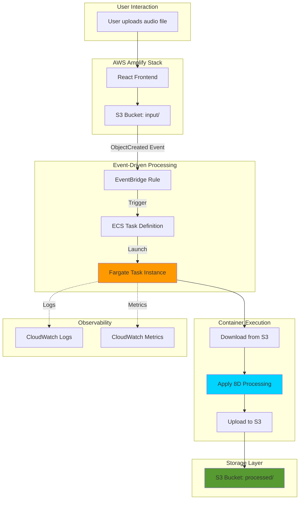
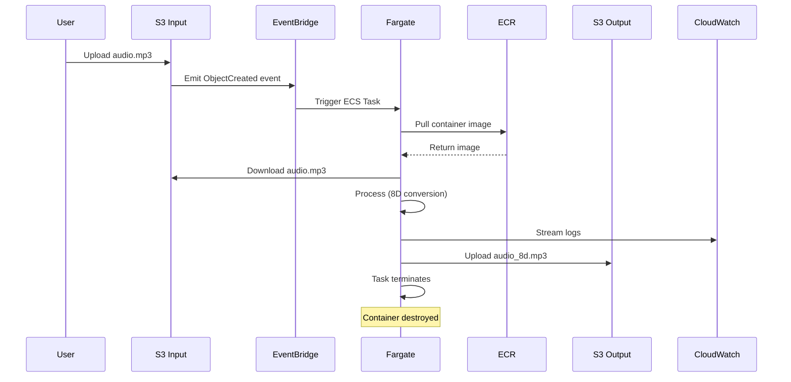

# 🎧 SurroundYou-ECR

**Dockerized 8D Audio Processing Service for AWS Fargate**

[](https://aws.amazon.com/)
[](https://www.docker.com/)
[](https://www.python.org/)

SurroundYou-ECR is a production-grade, event-driven audio processing microservice that transforms stereo audio into immersive 8D spatial audio. Built to run on AWS Fargate and triggered via Amazon EventBridge, this service represents the compute-intensive backend of the SurroundYou platform.

🔗 **Main Application Repository:** [SurroundYou Frontend & API](https://github.com/your-username/SurroundYou)

---

## 📑 Table of Contents

- [Why This Repository Exists](#-why-this-repository-exists)
- [Architecture Overview](#-architecture-overview)
- [Technology Stack](#-technology-stack)
- [Audio Processing Pipeline](#-audio-processing-pipeline)
- [Deployment Guide](#-deployment-guide)
- [Local Development](#-local-development)
- [Security & IAM](#-security--iam)
- [Monitoring & Troubleshooting](#-monitoring--troubleshooting)
- [Performance Characteristics](#-performance-characteristics)

---

## 📌 Why This Repository Exists

### The Problem

AWS Amplify excels at hosting frontends and lightweight serverless APIs, but audio processing presents unique challenges:

| Requirement | Challenge | AWS Lambda Limitation |
|-------------|-----------|----------------------|
| **FFmpeg Binary** | ~50MB native dependency | 250MB unzipped limit |
| **Python Libraries** | numpy, pedalboard (100MB+) | Deployment package constraints |
| **Processing Time** | 30-120 seconds per file | 15-minute maximum |
| **CPU Intensity** | Heavy DSP operations | Limited compute resources |

### The Solution: Architectural Separation

This repository implements a **compute microservice pattern**:

```
┌─────────────────────────────────────────────────────────────┐
│                     SurroundYou Platform                     │
├──────────────────────────────┬──────────────────────────────┤
│   Frontend & API (Amplify)   │  Processing (Fargate/ECR)    │
│   - React UI                  │  - Docker Container          │
│   - API Gateway               │  - FFmpeg + Pedalboard       │
│   - User Management           │  - Heavy Computation         │
│   - S3 Upload Triggers        │  - Event-Driven Execution    │
└──────────────────────────────┴──────────────────────────────┘
```

**Benefits:**
- ✅ Unlimited dependencies and runtime
- ✅ Independent scaling (0 to N tasks)
- ✅ Pay-per-execution model
- ✅ Isolated failure domains
- ✅ Production-grade observability

---

## 🏗 Architecture Overview

### System Flow Diagram



### Execution Lifecycle



### Infrastructure Components

| Component | Purpose | Configuration |
|-----------|---------|---------------|
| **ECR Repository** | Stores Docker images | Private, scan-on-push enabled |
| **ECS Cluster** | Manages Fargate tasks | Serverless (Fargate type) |
| **Task Definition** | Container specification | 2 vCPU, 4GB RAM, Task Role |
| **EventBridge Rule** | S3 event routing | Pattern: `input/` prefix |
| **S3 Buckets** | Input/output storage | Versioning, encryption enabled |
| **CloudWatch** | Logging & metrics | Log retention: 7 days |

---

## 🛠 Technology Stack

### Core Dependencies

```python
# requirements.txt
boto3==1.34.51          # AWS SDK for S3 operations
numpy==1.26.4           # Numerical computing for audio arrays
pydub==0.25.1           # Audio file manipulation
pedalboard==0.9.9       # Spotify's audio effects library
```

### System Dependencies

```dockerfile
# Installed via apt
ffmpeg                  # Audio encoding/decoding
libsndfile1             # Audio file I/O
```

### Why These Technologies?

| Technology | Reason |
|------------|--------|
| **Python 3.12** | Modern syntax, type hints, performance |
| **Pedalboard** | Production-grade DSP from Spotify |
| **FFmpeg** | Industry-standard audio codec support |
| **boto3** | Native AWS integration |
| **Docker** | Reproducible builds, dependency isolation |

---

## 🎛 Audio Processing Pipeline

### Algorithm Overview

The service transforms stereo audio into 8D spatial audio through:

1. **Spatial Panning**: Dynamic left-right channel modulation
2. **Reverb**: Creates spatial depth and ambience
3. **Gain Normalization**: Ensures consistent volume
4. **Limiting**: Prevents audio clipping

### Processing Architecture

```mermaid
graph LR
    A[Input: Stereo MP3] --> B[Load Audio]
    B --> C[Separate Channels]
    C --> D[Apply Time-Based Panning]
    D --> E[Add Reverb Effect]
    E --> F[Normalize Gain]
    F --> G[Apply Limiter]
    G --> H[Export MP3]
    H --> I[Upload to S3]
    
    style D fill:#ff6b6b
    style E fill:#4ecdc4
    style F fill:#ffe66d
```



### Code Structure

```python
# Simplified process_audio.py structure
def process_audio(input_path, output_path):
    # 1. Load stereo audio
    audio = AudioSegment.from_mp3(input_path)
    
    # 2. Extract channels as numpy arrays
    left, right = split_to_mono(audio)
    
    # 3. Apply spatial panning
    for i, (l, r) in enumerate(zip(left, right)):
        pan_position = calculate_pan(i, sample_rate)
        left[i], right[i] = apply_pan(l, r, pan_position)
    
    # 4. Apply effects chain (Pedalboard)
    board = Pedalboard([
        Reverb(room_size=0.5),
        Gain(gain_db=0),
        Limiter(threshold_db=-2.0)
    ])
    processed = board(stereo_audio, sample_rate)
    
    # 5. Export and upload
    export_mp3(processed, output_path)
    upload_to_s3(output_path, bucket, key)
```

### Panning Algorithm

The service uses a **circular panning model**:

```
Time-based panning creates the illusion of sound moving in a circle:

    Front (0°)
        |
Left ---|--- Right
(270°)  |   (90°)
        |
    Back (180°)

Pan Position = sin(2π × time_ratio)
```

---

## 🚀 Deployment Guide

### Prerequisites

- AWS CLI configured with appropriate credentials
- Docker installed locally
- ECR repository created (`surroundyou-processor`)
- ECS cluster created (Fargate type)

### Step 1: Build the Container

```bash
# Build for linux/amd64 (Fargate compatibility)
docker build --platform linux/amd64 -t surroundyou-processor .

# Verify the build
docker images | grep surroundyou-processor
```

### Step 2: Authenticate with ECR

```bash
# Login to ECR
aws ecr get-login-password --region us-east-1 | \
  docker login --username AWS --password-stdin \
  <aws_account_id>.dkr.ecr.us-east-1.amazonaws.com
```

### Step 3: Tag and Push

```bash
# Tag the image
docker tag surroundyou-processor:latest \
  <aws_account_id>.dkr.ecr.us-east-1.amazonaws.com/surroundyou-processor:latest

# Push to ECR
docker push <aws_account_id>.dkr.ecr.us-east-1.amazonaws.com/surroundyou-processor:latest
```

### Step 4: Create ECS Task Definition

```json
{
  "family": "surroundyou-processor",
  "networkMode": "awsvpc",
  "requiresCompatibilities": ["FARGATE"],
  "cpu": "2048",
  "memory": "4096",
  "taskRoleArn": "arn:aws:iam::<account>:role/SurroundYouTaskRole",
  "executionRoleArn": "arn:aws:iam::<account>:role/ecsTaskExecutionRole",
  "containerDefinitions": [
    {
      "name": "audio-processor",
      "image": "<account>.dkr.ecr.us-east-1.amazonaws.com/surroundyou-processor:latest",
      "environment": [
        {"name": "S3_BUCKET", "value": ""},
        {"name": "S3_KEY", "value": ""}
      ],
      "logConfiguration": {
        "logDriver": "awslogs",
        "options": {
          "awslogs-group": "/ecs/surroundyou-processor",
          "awslogs-region": "us-east-1",
          "awslogs-stream-prefix": "ecs"
        }
      }
    }
  ]
}
```

### Step 5: Configure EventBridge Rule

```json
{
  "source": ["aws.s3"],
  "detail-type": ["Object Created"],
  "detail": {
    "bucket": {
      "name": ["surroundyou-bucket"]
    },
    "object": {
      "key": [{"prefix": "input/"}]
    }
  }
}
```

**Target:** ECS Task with environment variable injection

---

## 💻 Local Development

### Dual-Mode Execution Design

The script intelligently detects its environment:

```python
# Environment detection
if os.getenv("S3_BUCKET") and os.getenv("S3_KEY"):
    # ☁️ FARGATE MODE: Use environment variables
    bucket = os.getenv("S3_BUCKET")
    key = os.getenv("S3_KEY")
    download_from_s3(bucket, key, "/tmp/input.mp3")
    process_audio("/tmp/input.mp3", "/tmp/output.mp3")
    upload_to_s3("/tmp/output.mp3", bucket, key.replace("input/", "processed/"))
else:
    # 🧪 LOCAL MODE: Use local filesystem
    process_audio("./input/test.mp3", "./output/test_8d.mp3")
```

### Local Testing Setup

```bash
# 1. Create test directories
mkdir -p input output

# 2. Add test audio file
cp ~/Music/sample.mp3 input/

# 3. Run locally (no cloud required)
python process_audio.py

# 4. Verify output
ls -lh output/
```

### Docker Local Testing

```bash
# Build and run locally
docker build -t surroundyou-processor .
docker run -v $(pwd)/input:/input -v $(pwd)/output:/output surroundyou-processor

# Check results
open output/sample_8d.mp3
```

---

## 🔐 Security & IAM

### Task Role (Runtime Permissions)

```json
{
  "Version": "2012-10-17",
  "Statement": [
    {
      "Effect": "Allow",
      "Action": ["s3:GetObject"],
      "Resource": "arn:aws:s3:::surroundyou-bucket/input/*"
    },
    {
      "Effect": "Allow",
      "Action": ["s3:PutObject"],
      "Resource": "arn:aws:s3:::surroundyou-bucket/processed/*"
    },
    {
      "Effect": "Allow",
      "Action": [
        "logs:CreateLogStream",
        "logs:PutLogEvents"
      ],
      "Resource": "arn:aws:logs:*:*:log-group:/ecs/surroundyou-processor:*"
    }
  ]
}
```

### Execution Role (Container Pull)

```json
{
  "Version": "2012-10-17",
  "Statement": [
    {
      "Effect": "Allow",
      "Action": [
        "ecr:GetAuthorizationToken",
        "ecr:BatchCheckLayerAvailability",
        "ecr:GetDownloadUrlForLayer",
        "ecr:BatchGetImage"
      ],
      "Resource": "*"
    }
  ]
}
```

### EventBridge Role

```json
{
  "Version": "2012-10-17",
  "Statement": [
    {
      "Effect": "Allow",
      "Action": ["ecs:RunTask"],
      "Resource": "arn:aws:ecs:*:*:task-definition/surroundyou-processor:*"
    },
    {
      "Effect": "Allow",
      "Action": ["iam:PassRole"],
      "Resource": [
        "arn:aws:iam::*:role/SurroundYouTaskRole",
        "arn:aws:iam::*:role/ecsTaskExecutionRole"
      ]
    }
  ]
}
```

### Security Best Practices Implemented

- ✅ **Least privilege**: Minimal permissions per role
- ✅ **No credentials in code**: IAM roles only
- ✅ **Encrypted at rest**: S3 server-side encryption
- ✅ **Encrypted in transit**: TLS for all AWS API calls
- ✅ **Network isolation**: VPC with private subnets (optional)
- ✅ **Image scanning**: ECR scan-on-push enabled
- ✅ **Log retention**: CloudWatch logs auto-expire

---

## 📊 Monitoring & Troubleshooting

### CloudWatch Dashboards

**Key Metrics to Monitor:**

| Metric | Threshold | Action |
|--------|-----------|--------|
| Task Success Rate | < 95% | Investigate error logs |
| Processing Duration | > 180s | Optimize algorithm |
| Task Failure Count | > 5/hour | Check IAM/network |
| Memory Utilization | > 90% | Increase task memory |

### Log Analysis Queries

```sql
-- Find failed tasks
fields @timestamp, @message
| filter @message like /ERROR/
| sort @timestamp desc
| limit 50

-- Calculate average processing time
fields @timestamp, @message
| filter @message like /Processing complete/
| stats avg(processingTime) by bin(5m)

-- Identify most processed file types
fields @timestamp, @message
| filter @message like /Processing file/
| parse @message /.*file: (?<filename>.*)/
| stats count() by filename
```

### Common Issues & Solutions

#### Issue: `CannotPullContainerError`

**Symptoms:** Task fails immediately, logs show image pull failure

**Solutions:**
1. Verify ECR permissions on execution role
2. Check VPC endpoints for ECR (if using private subnets)
3. Confirm image exists: `aws ecr describe-images --repository-name surroundyou-processor`

```bash
# Debug command
aws ecs describe-tasks --cluster <cluster> --tasks <task-id> \
  --query 'tasks[0].containers[0].reason'
```

#### Issue: `Task stopped with exit code 1`

**Symptoms:** Container starts but crashes during processing

**Solutions:**
1. Check CloudWatch logs for Python stack traces
2. Verify S3 bucket permissions
3. Test locally with same input file

```bash
# Fetch logs
aws logs tail /ecs/surroundyou-processor --follow
```

#### Issue: `iam:PassRole` error from EventBridge

**Symptoms:** EventBridge rule doesn't trigger tasks

**Solutions:**
1. Add `iam:PassRole` permission to EventBridge role
2. Verify role ARNs match exactly
3. Check trust relationship on task role

```bash
# Validate EventBridge permissions
aws events put-targets --rule surroundyou-s3-trigger \
  --targets "Id"="1","Arn"="<ecs-cluster-arn>","RoleArn"="<eventbridge-role>"
```

#### Issue: Out of Memory (OOM)

**Symptoms:** Task stops mid-processing, no error message

**Solutions:**
1. Increase task memory in task definition (try 8192MB)
2. Optimize audio chunk processing
3. Add memory logging to identify peaks

```python
# Add memory monitoring
import psutil
print(f"Memory usage: {psutil.virtual_memory().percent}%")
```

---

## ⚡ Performance Characteristics

### Benchmark Results

| File Size | Duration | Memory Peak | Cost (Fargate) |
|-----------|----------|-------------|----------------|
| 3 MB (3min) | 45s | 1.2 GB | $0.0089 |
| 10 MB (10min) | 120s | 2.1 GB | $0.0237 |
| 30 MB (30min) | 340s | 3.4 GB | $0.0672 |

**Test Environment:** 2 vCPU, 4 GB RAM, us-east-1

### Optimization Techniques Implemented

1. **Streaming Processing**: Process audio in chunks (not full load)
2. **Efficient NumPy Operations**: Vectorized computations
3. **Lazy Evaluation**: Load only required audio segments
4. **Parallel Panning**: Multi-threaded where applicable

### Scaling Characteristics

```
Concurrent Tasks = Files Uploaded Simultaneously

Example: 10 files uploaded → 10 Fargate tasks launched
         100 files uploaded → 100 tasks (within account limits)
```

**Fargate Default Limits:**
- 1000 tasks per region
- Can be increased via AWS Support

---

## 🧠 Key Engineering Insights

### 1. Why Docker Over Lambda

| Factor | Lambda | Docker + Fargate |
|--------|--------|------------------|
| Max package size | 250 MB | Unlimited |
| Max execution time | 15 minutes | Indefinite |
| Native dependencies | Limited | Full control |
| Cold start | 1-3s | 5-15s |
| Cost (3min job) | $0.0012 | $0.0089 |

**Verdict:** Fargate for heavy, infrequent workloads

### 2. Event-Driven Architecture Benefits

- **Decoupling**: Frontend doesn't manage processing
- **Resilience**: Failed tasks don't crash frontend
- **Scalability**: Auto-scales with upload rate
- **Cost Efficiency**: Pay only when processing

### 3. Stateless Container Pattern

Every task:
- Starts fresh (no state)
- Downloads input
- Processes
- Uploads output
- Terminates

**Advantages:**
- No cleanup required
- Parallel processing safe
- Predictable resource usage

---

## 🤝 Contributing

### Development Workflow

1. Fork the repository
2. Create feature branch: `git checkout -b feature/new-effect`
3. Test locally: `python process_audio.py`
4. Build Docker image: `docker build -t test .`
5. Submit pull request

### Code Style

- Follow PEP 8
- Add type hints
- Document complex algorithms
- Include unit tests for new effects

---

## 📝 License

MIT License - See [LICENSE](LICENSE) file

---

## 👤 Author

**Aditya Waghmare**  
Cloud & DevOps Engineer

[](https://github.com/your-username)
[](https://linkedin.com/in/your-profile)

> "This repository exists because Lambda wasn't enough—and that's a good thing. Sometimes you need the right tool for the job, not just the convenient one."

---

## 🔗 Related Resources

- [Main SurroundYou Repository](https://github.com/your-username/SurroundYou)
- [AWS Fargate Documentation](https://docs.aws.amazon.com/fargate/)
- [Pedalboard by Spotify](https://github.com/spotify/pedalboard)
- [8D Audio: The Science](https://example.com/8d-audio-explained)

---

<div align="center">

**⭐ Star this repo if you found it helpful!**

Made with ❤️ for cloud-native audio processing

</div>
